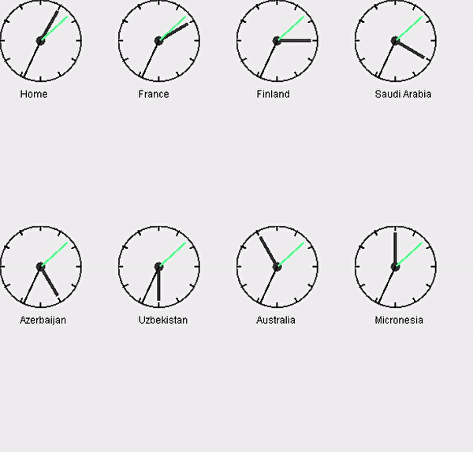

[![LinkedIn][linkedin-shield]][linkedin-url]

<!-- PROJECT LOGO -->
 

    

<h3 align="center">Clocks</h3>

  

   Clocks telling the time in eight different regions.
     
  

<!-- TABLE OF CONTENTS -->

  
Table of Contents

  <ol>
    <li>
      <a href="#about-the-project">About The Project</a>
      <ul>
        <li><a href="#built-with">Built With</a></li>
      </ul>
    </li>
    <li><a href="#license">License</a></li>
  </ol>

<!-- ABOUT THE PROJECT -->
## About The Project

This was a second year exam question which I failed to complete at the time, so I decided to complete it later. 
The time is aquired through the java LocalTime class and then angles are calculated to get the time in minutes translated into degrees. 

You shall find in the repository that there are more clock classes. Those were questions one and two dealing with sockets and java networking principles.

### Built With

Built with good old [Java](https://www.java.com/en/)

<!-- LICENSE -->
## License

Distributed under the General Public License. See `LICENSE` for more information.

<!-- CONTACT -->
## Contact

Linda Scoon - [@linda_scoon](https://twitter.com/linda_scoon) - Twitter

<!-- MARKDOWN LINKS & IMAGES --> 
[linkedin-shield]: https://img.shields.io/badge/-LinkedIn-black.svg?style=for-the-badge&logo=linkedin&colorB=555
[linkedin-url]: https://www.linkedin.com/in/linda-scoon/
